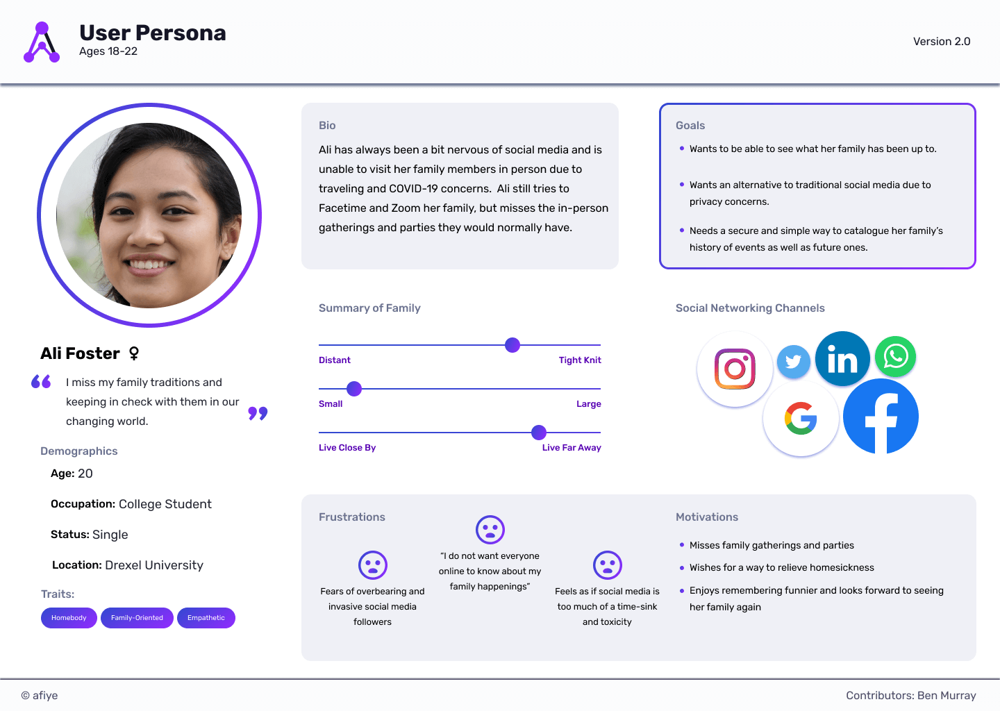
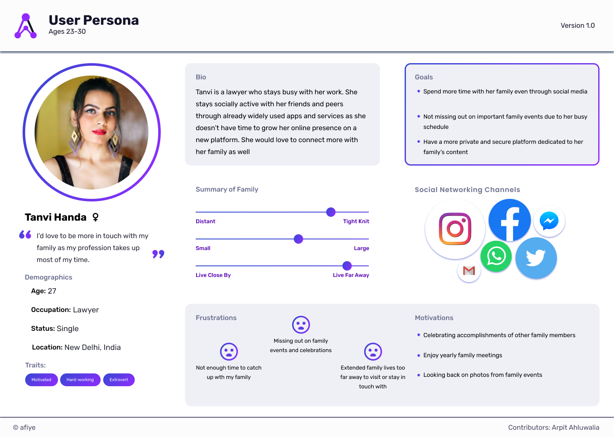
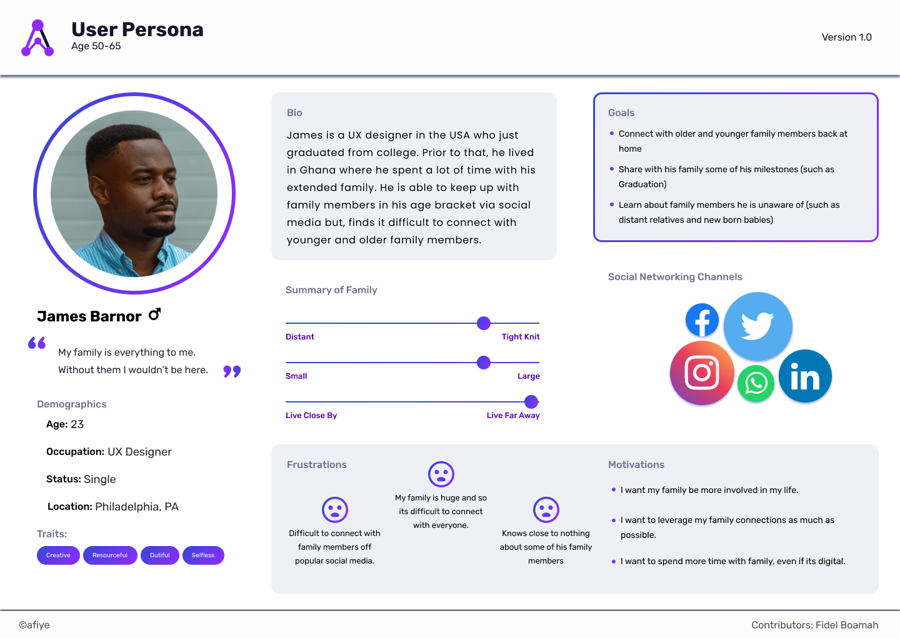
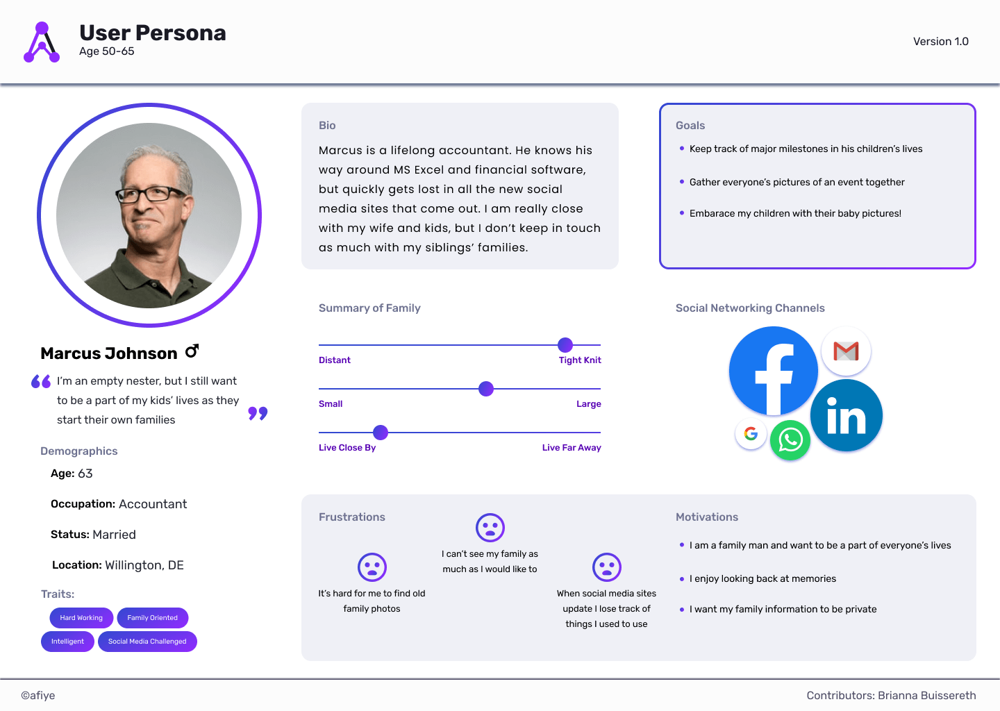
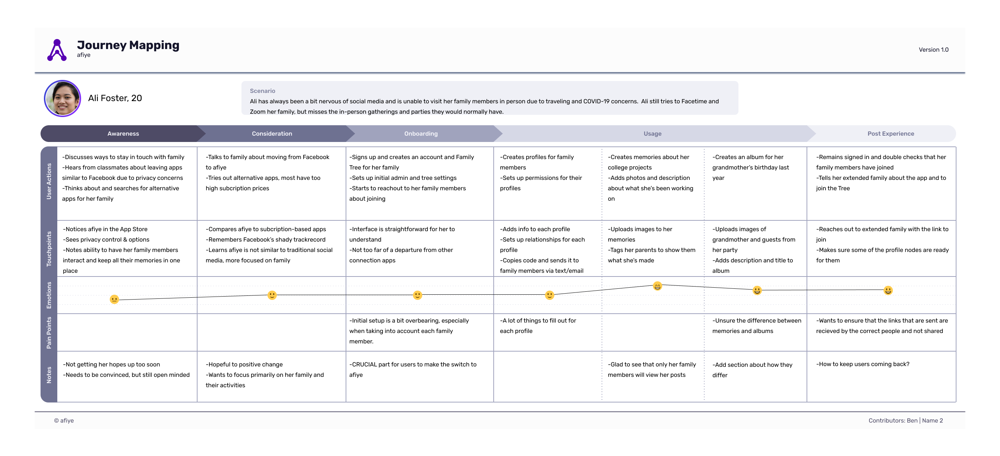
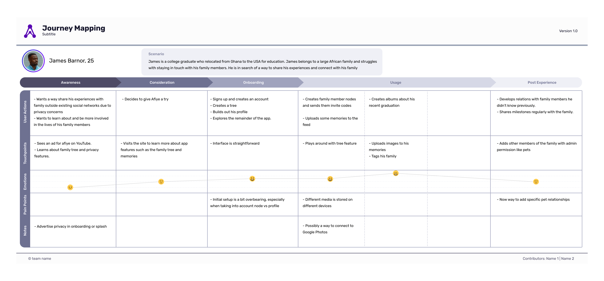
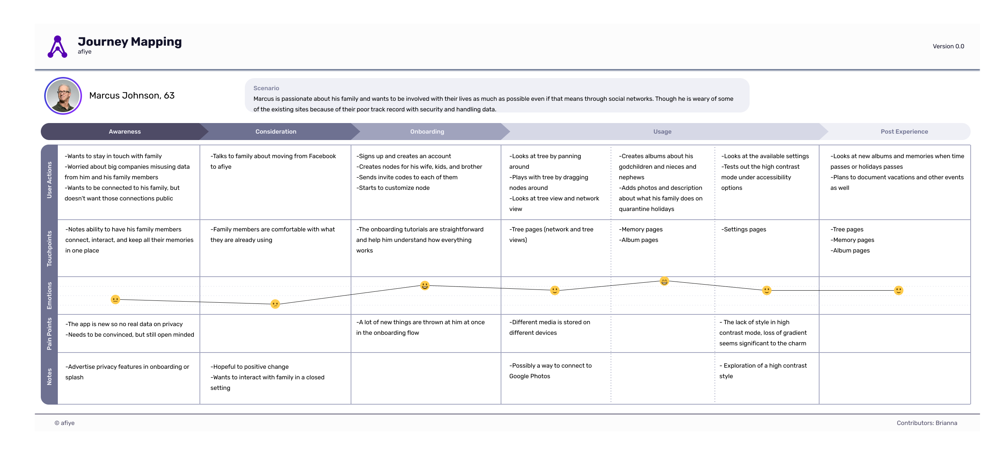

# User Experience Research

## Initial Survey

We wanted to confirm our target audience and what exactly they were looking for in our project, so we sent out Google Surveys to peers, families and friends.  This initial survey was to help better identify family sizes, family dynamics and social networking and how social media is used in these families.  Upon recieving their comments and answers to the questions, we performed survey analysis to review and quantify their responses.  This initial survey was vital to understanding our users and who we are making our project for.

[Survey Analysis (View Only)](https://docs.google.com/document/d/1FRnMkmJf4eU00AY5tFJ1J-UZ8iFfKFoPRqiLLTi652E/edit?usp=sharing)

## User Personas

After reviewing the survey results, we used what was found to create user personas.

These user personas are to better visualize our target audiences and are extremely useful as refrence throughout the project.  With users given bios, app experience and values, each of the three personas act as a summarized look into different age groups.

[View on Figma](https://www.figma.com/file/H1x8uEzPZo9c4mPEOa1el5/User-Personas?node-id=0%3A1)

## User Workshops

### User Interviews Takeaways

- Families are obviously, extremely diverse.
- We must take into account families of 2 or 100+.
- Social Media apps can have too much noise, spam and invasive ads which makes finding specific images or things hard.
- Users are looking for a streamlined, simplified way to store and share things with only specific people, their family.
- Users would never post their children on Facebook, so the privacy of Afiye was welcoming.

### Usability Testing Takeaways

-Initial layout without a search option for the tree was confusing.
-Streamlining the feed and account creation was a must to ensure users were not turned away from their first interaction with Afiye.
-The bottom nav Afiye uses is common for browser versions of apps such as Twitter and Instagram.

### Task Analysis Takeaways

- Onboarding and Feed screens were straightforward.
- The album and memory creation tasks were initially too similar and confusing for some.
- We found that if users were unsure what to do, they went to the settings area to find help.

### Language Use in Afiye Takeaways

- Sometimes, the word "tree" is associated with genealogy, which was not our goal.
- The "feed" made as much sense for older users as it did for younger users.
- Some of the onboarding words we used such as "join a tree" did not make sense without an explanation.

## Journey Maps

[View on Figma](https://www.figma.com/file/H1x8uEzPZo9c4mPEOa1el5/User-Personas?node-id=88%3A252)
