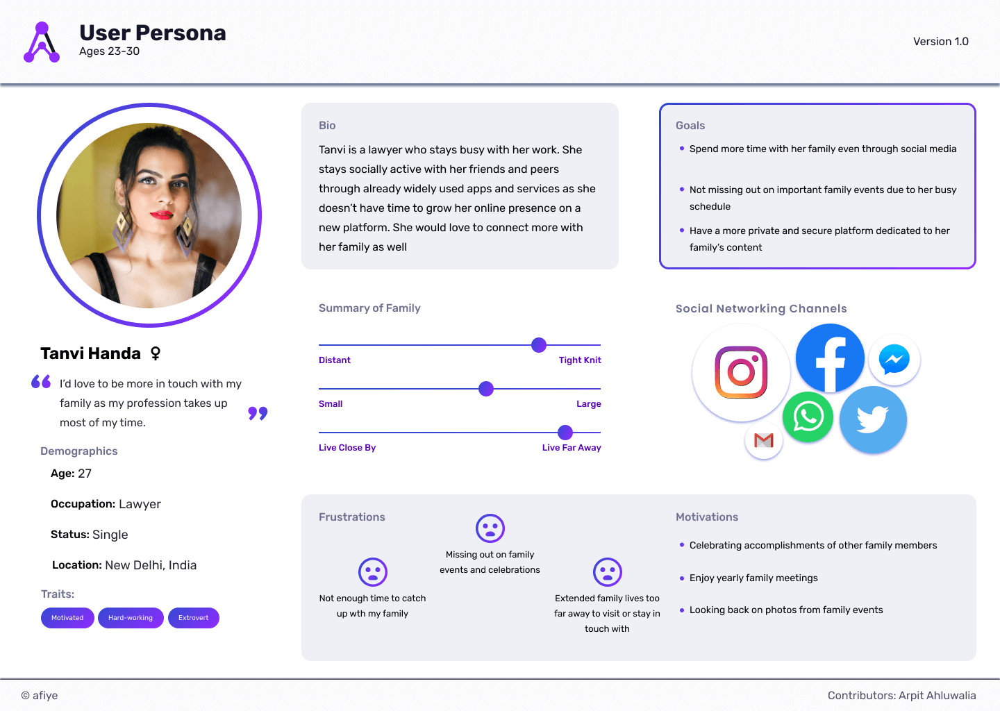
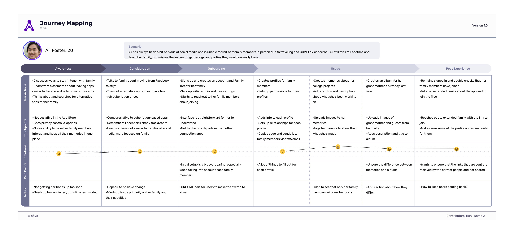
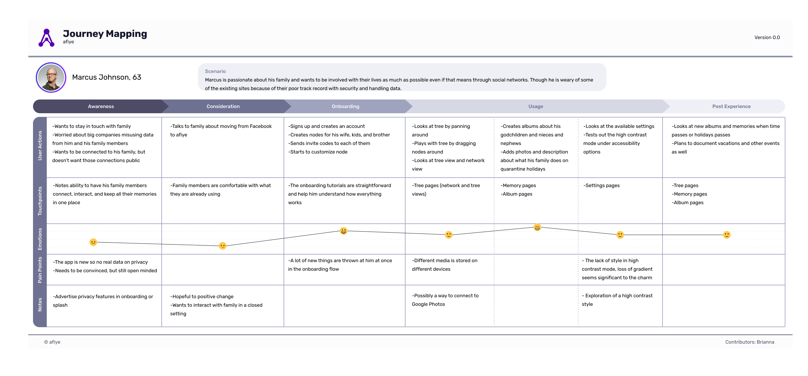

# User Experience Research

## Initial Survey

We wanted to confirm our target audience and what exactly they were looking for in our project, so we sent out Google Surveys to peers, families and friends.  This initial survey was to help better identify family sizes, family dynamics and social networking and how social media is used in these families.  Upon recieving their comments and answers to the questions, we performed survey analysis to review and quantify their responses.  This initial survey was vital to understanding our users and who we are making our project for.

[Survey Analysis (View Only)](https://docs.google.com/document/d/1FRnMkmJf4eU00AY5tFJ1J-UZ8iFfKFoPRqiLLTi652E/edit?usp=sharing)

## User Personas

After reviewing the survey results, we used what was found to create user personas.

These user personas are to better visualize our target audiences and are extremely useful as refrence throughout the project.  With users given bios, app experience and values, each of the three personas act as a summarized look into different age groups.

[View on Figma](https://www.figma.com/file/H1x8uEzPZo9c4mPEOa1el5/User-Personas?node-id=0%3A1)

## User Interviews

During the COVID-19 pandemic, in-person interviews have become extremely hard to do.  Our team used Zoom for interviews and had open discussions about what users want to see from the project.  Also, being able to show users what we have been working on helps guage what direction we should go into.

## Journey Maps

[View on Figma](https://www.figma.com/file/H1x8uEzPZo9c4mPEOa1el5/User-Personas?node-id=88%3A252)
